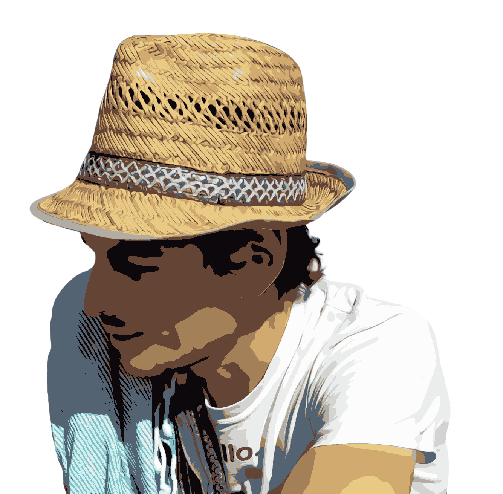

### Oh hello there 👋 ! It's me, [Julien Leicher](https://julien.leicher.me),

I'm a **freelance software engineer** living in France. Although I don't really like the term **fullstack engineer**, that's what qualify me the best since I've worked on:

- Mobile apps with **React Native**,
- Backend **GraphQL** and **REST** web services in **Typescript**, **C#**, **Go** and **PHP**,
- Front end stuff with **React**, **VueJS** and a lot of traditional template based language (**Razor**, **Twig**, **Go template/html**)
- a lot of libraries in **Python**, **Typescript/Javascript**
- Desktop apps with **WPF**

Beside all those shiny tech stuff ✨, I'm a big fan of **Domain Driven Design** and the **Clean architecture**.

I ❤ open-source and I'm currently trying to contribute to an alternative, decentralized web using the [Solid](https://solidproject.org/) platform.
